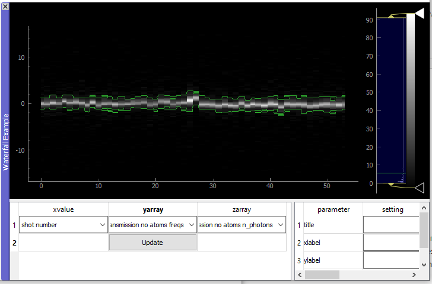

# What is the Analysis Plot Panel?

The analysis plot panel is a tool to plot data produced from [labscript suite](https://labscriptsuite.org/) based experiments in an fast end efficient way. It is directly linked to the lyse package using single-shot routines. 

The code has been developed by the [laboratory of quantum gases](https://www.epfl.ch/labs/lqg/). Check our [github page](https://github.com/LQG-EPFL) for other useful tools.

The module is based on three packages:

1. `pyqtgraph`: An ultra-fast plotting library
2. `h5py`: A python package to read data from h5 files
3. `pyqt5`: The python wrapper of the qt5 GUI library

The panel is made up of individual plots, the shot selector and the quick plot generator. The individual plots can either be [customized plots](index.md#make-a-custom-plot) (implemented in the `user_plot.py` file) or it can be one of the tree different types of so-called [quick plots](index.md#quick-plot-generator
) (`Quick1DPlot`, `QuickWaterfallPlot` and `Quick2DPlot`). These allow the user to plot trends of the acquired data without having to write a special plotting function. For more information on the installation check our [installation page](installation.md).

# Shot Selector


In the shot selector one can specify for which shot/shots the data should be plotted. For plots that show data from a single shot, the slider or the text field on the left of it can be used to choose the shot. The index selector text field is used to specify the subset of shots to be show in the analysis plot panel. 

Examples:

- `:` The selection of indices (shots) for the slider and the quick plots are the complete list in lyse
- `2:5, -1` The selected indices are 2,3,4 and -1
- `1:10:2` The selected indices are every odd number up to 10

# Quick Plot Generator

As the name suggest, the quick plot generator can be used to make quick plot. These can be used to show data of multiple shots in lyse in a fast way.


In order to generate a plot, one has to specify the title of the plot (here: 2D Example) and then press the right button to either generate a `Quick1DPlot`, `QuickWaterfallPlot` or `Quick2DPlot`.

## Quick1DPlot


A quick 1D plot can show multiple plots of single valued results (a single number per shot). An example would be plotting atom number as a function of shot number. In the plot parameters section one can set the title, xlabel, ylabel and activate the grid. The units field should be filled with the units of the data (ex: s for second). The plot will then change the units that the ticks are as readable as possible (0.001s -> 1 ms).

## Quick Waterfall Plot



Quick waterfall plots allow the user to plot array-valued results as a function of single-valued results. The example above shows cavity spectra as a function of the shot number. The plot parameters are the same as for the `Quick1DPlot`. 

## Quick 2D Plot

`Quick2DPlot`s are the similar to `Quick1DPlot`s. The difference is that they plot a single-valued result as a function of two other single-valued results.

# Make a Custom Plot

Each plot is made up of two parts, the Plot Widget and the Data Extractor. The Plot Widget specifies how the results are shown and the Data Extractors specify how the results are extracted from the h5 files. The usual template class `AnalysisPlot` (found in `__init__.py` file) consists of tree parts, the actual plot, a table to show single valued data (like atom numbers) and a title/warning field. For the plots the pyqtgraph library is used. In the following, I will go through the steps to make a new plot. I will explain this on the example of the `SpectrumPlot`that can be found in the `user_plots.py` file.

### PlotWidget

1. Write a new class in the `user_plots.py` that inherits from the `AnalysisPlot` class. With the following things in the `__init__`:

   1. Add plots to the `pyqtgraph.GraphicsLayoutWidget`named `self.plots` using  `self.plot = self.plots.addPlot()`. This will generate a `PlotWidget` named `self.plot`. 
   2. Add a curve to the `PlotWidget` with 

```python
self.curve_hist = self.plot.plot(args)
```
   The style of the plot can be adapted with the args. Check the documentation of pyqtgraph for the syntax. One can also add x- and y-labels to the `PlotWidget`with `self.plot.setLabel(...)`

2. The next important step is to write an update function. This function takes the results of the shot in terms of `numpy.array`s and updates the curves with functions like 

```python
def update(self, freqs, counts):
	self.curve_hist.setData(freqs, counts)
```

   Here one can also add data to the table with:

```python
self.table.setData(tabledata)
```

   For the generation of tabledata check the syntax of the `TableWidget` in pyqtgraph.

### DataExtractor

1. Write a new class that inherits from `DataExtractor` in `user_data_extractors.py`. Specify in the `__init__` some identifying keyworks. (here: name and frametype of the spectrum). Like this the class 'knows' from which spectrum it should extract the data.

2. Write the function `extract_data` in the following structure:

```python
def extract_data(self, h5_path, h5_file = None):
    #make run instance
    run = lyse.Run(h5_path)

    imaging = 'cavity_spectrum'
    #make identifying keyword here: spectrum_name
    name = self.name
    frametype = self.frametype

    spectrum_name = name+' '+frametype

    try:
        #write functions here to extract the data:
        #make sure that you hand over the h5_file. This can lead to a speedup
        #since then the files doen't get opened for every variable
        n_photons = run.get_result_array(imaging, spectrum_name+' n_photons', h5_file = h5_file)
        freqs = run.get_result_array(imaging, spectrum_name+' freqs', h5_file = h5_file)

        except:
            #write here what should happen if the data could not be found
            import traceback
            traceback.print_exc()
            freqs, n_photons = np.array([0.,1.]), np.array([0.,1.])

            return freqs, n_photons #These are the arguments that are given to 
        # the update function of the PlotWidget.
```

   

## Add plot to plot panel

The last step is to make sure  that the PlotWidget and DataExtractor are added to the analysis plot panel. For this one should call `fm.ap.add_plot_dock(plot_name, AnalyisPlot, DataExtractor).`

