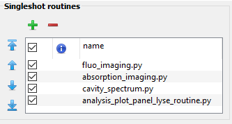

# Installation

## Download

The Analysis Plot Panel is though to be used as a single shot routine in lyse. In order to set this up, one first has to clone the git into the folder where all the analysis scripts are stored (usually: `C:\Users\user_name\labscript-suite\userlib\analysislib\experiment_name`), where `user_name` and `experiment_name` have to be changed individually.

## Additional packages required

The analysis plot panel requires the following packages:

- `lyse`: Installed with the labscript suite 
- `pyqt5`: Installed with the labscript suite 
- `pyqtgraph`: Installed with the labscript suite (version >= 0.11.1, if you installed labscript using conda`pyqtgraph` has to be updated. This requires and update of labscript afterwards as well. ) 
- `h5py`: Installed with the labscript suite
- `sortedcontainers`: pip install sortedcontainers
- `scikit-image`: pip install skimage

!!! warning 
	All these packages should be installed in the correct python environment. Check the [installation guide of labscript](https://docs.labscriptsuite.org/en/stable/installation/setting-up-an-environment/#choosing-an-installation-method) for more details.

## Setup of lyse

To speedup the reading and writing of data to h5 files, it was necessary to rewrite the `__init__.py` and `__main__.py` file of the lyse package. Before, whenever one wanted to retrieve data from the h5 files, it would open the file and close it right after. This means that if you wanted 100s of results, it would open and close the file 100s of times. This took significantly more time than actually reading the data. In order to improve this, we added a key argument `h5_file = None` to all of the functions. If the argument is `None` the scripts will work as before. However, if it is given an h5_file, if will not open a new one, but retrieve the data from the file given. The new `__init__.py` and `__main__.py` file can be found in the `new_lyse_files` folder of this project. It should be placed in the lyse package folder using in `...\labscript-suite\.venv\Lib\site-packages\lyse`.

As a last step, the `analysis_plot_panel_lyse_routine.py` file should be loaded as a single shot routine in lyse:

